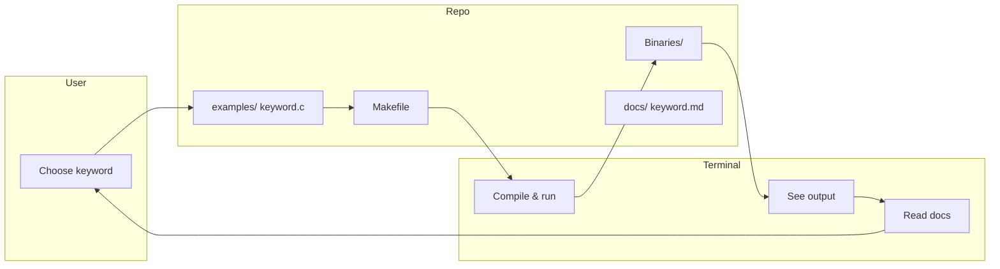

# C Keyword Mastery 

> Master all 44 C keywords across C89/C90, C99, and C11 standards with practical, runnable examples.


---

##  Overview

This project provides a **structured, hands-on reference** for every C keyword. Each keyword includes:
- ✅ **Tiny runnable example**
- ✅ **Expected output**
- ✅ **Common pitfalls**
- ✅ **Standard-specific notes**

---

##  Tiny Example – See It in Action

Every keyword has a minimal demo. Here's `static`:

```c
// examples/static.c
#include <stdio.h>

void counter() {
    static int count = 0;  // initialized once
    count++;
    printf("Called %d time(s)\n", count);
}

int main() {
    counter();  // Called 1 time(s)
    counter();  // Called 2 time(s)
    return 0;
}
```

**Output:**
```
Called 1 time(s)
Called 2 time(s)
```

**What you learn:** `static` preserves value between function calls.

---

## 🔄 Workflow – How You'll Learn

```text
┌─────────────┐     ┌─────────────┐     ┌─────────────┐     ┌─────────────┐
│ Select      │ ──▶ │ Read tiny   │ ──▶ │ Compile &   │ ──▶ │ Observe     │
│ keyword     │     │ example     │     │ run         │     │ output      │
└─────────────┘     └─────────────┘     └─────────────┘     └─────────────┘
                                                                     │
┌─────────────┐     ┌─────────────┐     ┌─────────────┐               │
│ Apply in    │ ◀── │ Review      │ ◀── │ Understand  │ ◀─────────────┘
│ your code   │     │ pitfalls    │     │ behavior    │
└─────────────┘     └─────────────┘     └─────────────┘
```

---

##  Project Flow – Code Architecture



---

##  Project Structure

```bash
c-keyword-mastery/
│
├── examples/               # Tiny, runnable keyword demos
│   ├── static.c            # static keyword example
│   ├── volatile.c
│   ├── restrict.c          # C99
│   └── _Generic.c          # C11
│
├── docs/                   # Detailed keyword explanations
│   ├── static.md
│   └── ...
│
├── tests/                  # Unit tests for keyword behavior
│   └── test_static.c
│
├── Makefile                # Build automation
├── README.md
└── LICENSE
```

---

##  Build & Run

### Prerequisites
- GCC or Clang
- Make

### Commands

```bash
# Build all examples
make

# Run a specific keyword example
make run keyword=static

# Run all tests
make test

# Clean binaries
make clean
```

### Manual run (if you prefer)

```bash
gcc examples/static.c -o static_demo
./static_demo
```

---

##  Keywords by Standard

| Standard | Keywords | Example |
|----------|----------|---------|
| **C89/C90** (32) | `auto`, `break`, `case`, `char`, `const`, `continue`, `default`, `do`, `double`, `else`, `enum`, `extern`, `float`, `for`, `goto`, `if`, `int`, `long`, `register`, `return`, `short`, `signed`, `sizeof`, `static`, `struct`, `switch`, `typedef`, `union`, `unsigned`, `void`, `volatile`, `while` | `static int x;` |
| **C99** (5) | `_Bool`, `_Complex`, `_Imaginary`, `inline`, `restrict` | `restrict char* ptr` |
| **C11** (7) | `_Alignas`, `_Alignof`, `_Atomic`, `_Generic`, `_Noreturn`, `_Static_assert`, `_Thread_local` | `_Static_assert(1, "ok");` |

**Total: 44 keywords**

---

##  Testing Example

Each keyword has a test verifying its behavior:

```c
// tests/test_static.c
#include <assert.h>

void counter() {
    static int calls = 0;
    calls++;
}

int main() {
    counter();
    counter();
    // Verify static internal state (via debug or harness)
    return 0;
}
```

Run with:
```bash
make test
```

---

##  Documentation Sample

Each keyword has a markdown file in `docs/`:

```markdown
# static

## Tiny example
(see examples/static.c)

## Output
Called 1 time(s)
Called 2 time(s)

## Pitfall
Static variables inside functions are not thread-safe.

## Best practice
Use for counters or caches that must persist across calls.
```

---

##  Contributing

1. Fork the repo
2. Create a branch: `git checkout -b feature/new-keyword`
3. Add tiny example in `examples/`
4. Add docs in `docs/`
5. Commit: `git commit -m "Add _Alignas example"`
6. Push: `git push origin feature/new-keyword`
7. Open a Pull Request

---

##  Roadmap

- [ ] Add all 44 examples
- [ ] Add C17/C23 notes
- [ ] Interactive CLI menu to browse keywords
- [ ] Memory visualization diagrams

---

##  License

MIT License – free for learning and teaching.

---

##  Support

If this helps you master C, give it a star ⭐


```

**Master C, one keyword at a time.**
```

This version gives you:
- **Tiny examples** embedded right in the README (like the `static` snippet).
- **Workflow diagram** (ASCII + Mermaid) showing the learning loop.
- **Project flow** showing how code, build, and docs connect.
- **Clear structure** so recruiters and learners see value instantly.
